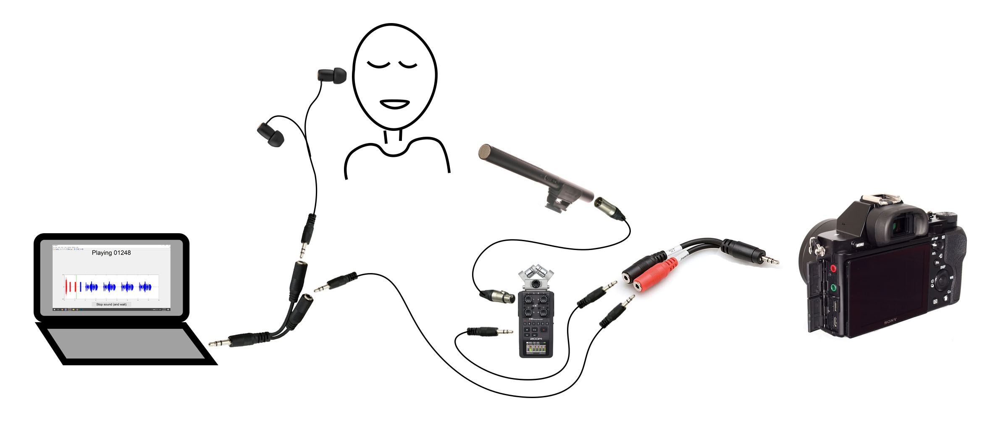

# How to create video material for the Matrix Sentence Test
This is a repository with guidelines and code to create visual material for the Matrix Sentence Test for speech audiometry. Please read the [scientific manuscript](https://www.tandfonline.com/doi/full/10.1080/14992027.2021.1930205) first, if you haven't.

## Getting the audio-only material
The audio-only material belongs to HörTech gGmbH. In principle, they can give you the material for research purposes for a limited period. You will find contact information on their [website](https://www.hoertech.de/). The specific website for the MST can be found in this [link](https://www.hoertech.de/en/devices/intma.html). You can directly specify that you need it for creating an audiovisual MST and that the audio files are required.

The audio-only MST from HörTech will be mentioned as "original audio" throughout this guide.

## Recording setup
You will need a computer, a camera, a microphone and probably a sound mixing table/handheld recorder. Each setup will depend on the equipment that you have available. We propose a setup with a mirrorless camera (sony alpha 7), a shotgun microphone, and a handheld recorder (Zoom H6).

### Audio routing
The camera needs to record two audio inputs at the same time: one from the talker (captured by the shotgun microphone) and another one from the computer, where the original audio is being played. Because most cameras have one audio input, the microphone audio, and the computer audio will be stored in the left and right channel of the camera audio input. This will be done with a mono-to-stereo cable that mixes two mono signals into a stereo (Hosa YMM261). The shotgun microphone will be connected to the Zoom H6 and the line out of the Zoom H6 will be connected to one of the audio inputs of the mono-to-stereo cable (Hosa YMM261). The computer will have two audio outputs from the headphone output. You can achieve that with a jack splitter. One of the outputs will be connected to the remaining audio input of the mono-to-stereo cable (Hosa YMM261) and the other will be connected to the earphones that the talker will use. The final connections should look like this:
- Microphone -> (XRL female -- XRL male) <- Zoom input channel 1
- Zoom line out -> (3.5mm jack male -- 3.5mm jack male) <- Mono-to-stereo cable input 1
- Computer audio output -> (3.5mm jack splitter male -- 3.5mm jack splitter female 1 -- 3.5mm jack male -- 3.5mm jack male) <- Mono-to-stereo cable input 2
- Computer audio output -> (3.5mm jack splitter male -- 3.5mm jack splitter female 2) <- earphone to the talker
- Mono-to-stereo cable output -> <- Camera audio input


According to this setup, you will need the following cables: an XRL cable (female-male), two 3.5mm jacks (male-male), a 3.5mm jack splitter (1 male-2 female), and a mono-to-stereo 3.5mm jack (2 female-1 male). You will probably need an extension cable for the earphones (3.5mm jack male-female).



The 3.5mm jack splitter and the mono-to-stereo 3.5mm jack are different cables. The first one duplicates a signal, whereas the second one creates a stereo mix from two mono signals. The cables look the same, but they are different inside and they are not interchangeable. 

### Recording settings
- Camera:
   · record at 50 or 60 fps, 1080p (Full HD). At 50 fps, one frame equals 20ms. Ideally, the camera records in mp4 or some other standard format.
   · avoid using automatic settings. If you do so, maybe the camera settings change during the recording session and one (video) sentence might look different from another.
   · use optical zoom if you have, to separate/blur the background. You can also play with the aperture to blur the background (specified as f/<number> in cameras).
   · do not use automatic gain control for audio
- Microphone:
  · use a shotgun microphone (also called boom I think) or a cardioid microphone, close to the speaker (e.g., above the speaker or below at the height of the knees and outside the recording frame of the camera).
  · check out this video for mic setups: https://www.youtube.com/watch?v=cusxbkwyvQ4.
  · never let the audio signal go over -12 dB in the camera and the handheld recorder.
  · avoid background noise and try to get a clean recording. It will affect your asynchrony scores later.

### Location
There will be the talker (person speaking the sentences) and the recording equipment (camera, handheld recorder, microphone, computer, and lights). Choose a chair/stool for the talker that is comfortable and also forces the talker to sit with a straight back. Avoid using chairs with a high backrest, as it could appear in the video unintentionally.

Choose an acoustically-treated room or a room where there is almost no reverberation. Avoid a room with natural light, as it can change throughout the recording session. Ideally, you want to get uniform lighting to the face of the talker, avoiding hard shadows. You can use two/three frontal-lateral diffuse light sources and one/two back hard light sources.

Choose a location with a uniform background. If you have the possibility, separate the talker from the back wall/background. You can increase this effect with the zoom and the aperture of the camera. You can also use a green/blue background. This is useful if you want to later want to change the background. Beware that you will need to be careful with the lighting. For example, back hard lights are recommended to separate the talker from the green background.

### Endurance
Batteries are very important, both for the equipment and the talker. A session with 150 sentences should last around 2 hours. Make sure that you have extra batteries for every piece of equipment. The battery of a Sony Alpha lasts around 30 minutes. If you can connect the camera with a power cord that would be ideal, otherwise bring extra batteries. The battery of the handheld recorder usually lasts longer than a recording session (over 20 hours). Check the same for the computer and lights (ideally all connected with power cords).

Make pauses for the talker. You don't want your talker to be tired, as the task requires being focused. Bring water/refreshments for the talker. To keep the same position of the talker in the chair/stool, you can use the display screen of the camera. By default, the display screen comes with a grid, usually by pressing the display button (DISP). You can use a non-permanent marker and directly paint on the display screen where the eyes and the mouth should always be.

### Choose the right talker
You should choose the right talker for your experiment. The most usual case is that you want a talker that is easy to speechread (lipread). Speech therapists and theater actors are a good choice.
   
### Legal issues
The talker should give your institution the image rights of the recorded material. You can find an [example (english)](docs/ImageRightsForm.docx) in this repository. Regarding the rights over the recorded speech, I am not sure if you can distribute it as the original audios from Hörtech gGmbH were used to create them. You should talk with HörTech gGmbH and seek legal advice about this topic.


## Recording session
The talker should keep the mouth closed before and after each sentence and keep the same place. He/she should keep a neutral face (not sad!) and look at the camera. Try that the prosody (intonation) is the same. Repeat the instructions now and then to the talker. 

To facilitate the recording session and the post-processing, there are scripts available. You need to follow the instructions in [NOTEBOOK_RECORDING.m](https://github.com/gerardllorach/audiovisualdubbedMST/blob/main/NOTEBOOK_RECORDING.m). We recommend that you read the Matlab script carefully, as they will speed up your recording session. 

### Pre-processing
During the recording session, the talker will listen to the sentences with cues. The talker will listen to something like this for a sentence: 
   ```
   -- Sentence code (morse) -- Beep -- Beep -- Beep -- Sentence -- Sentence -- Sentence -- Sentence.
   ```
   
   The sentence code (morse) is a signal that encodes the id of the sentence. In the Matrix Sentence Test, the sentences can be coded with 5 digits, each digit representing a word for each category. For example, 01932.wav represents 0-Peter, 1-has, 9-seven, 3-red, 2-cars and 37872.wav represents 3-John, 7-buys, 8-twelve, 7-big, 2-cars. This sentence code signal is used for post-processing. It helps to cut the videos and to identify the sentences automatically (you won't have to check all the videos and identify each sentence).
   
   The beep signals are cues for the talker. They are also used in post-processing for cutting the videos in the right place. After the beep signals, there are four sentence repetitions. The first one is for the talker to listen and the following three are for the talker to speak simultaneously. There is a GUI in the scripts that helps with the recording process. The sentences can be selected and the audio reproduction is visually shown (the audio envelope is plotted and a cursor moves through it over time).
   
### Post-processing
   Finding the sentences and selecting the best synchronous over a video file or several video files can be exhausting. The scripts provide an automatic process for cutting the videos, naming the cut videos with the sentence code and the take number, and for analyzing the asynchrony of each sentence-take. It does not matter if you have multiple video files or just one, the script processes all videos that are inside a given folder.

### Testing
Testing is most important. By testing the setup yourself, you will find out problems that should not appear during the recording session. Try to record 10-20 sentences and to get the final cut videos. You should also check that the sentences are correctly recorded and that you can extract the final videos that are the most synchronous.


